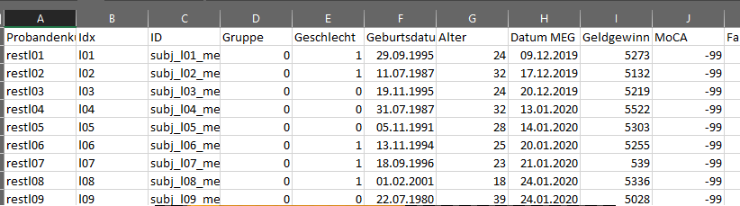

# Preprocessing

The preprocessing is relatively rigid
## In Short do the following
1. get your csv files from Stefans tool
1. save these files in the Folder "preprocessing"
1. perform the preprocessing in this tab

--------------

## In Long
You have to deliver your Input data as csv Files.   
Save them into a preprocessing folder   

*****
## Structure of csv Files
>The every csv File **MUST** have a column named "__ID__"  
>The csv File that represents behavioral data and subject information   
>must addionally include a column named "__Gruppe__"  
>The ID must identify the subjects unambiguously

Because delimiter setting is a pain, you can choose the delimiter as you like.  
- ;
- ,
- |  

If you do not know the delimiter, than open your file in a text editor and check it  

